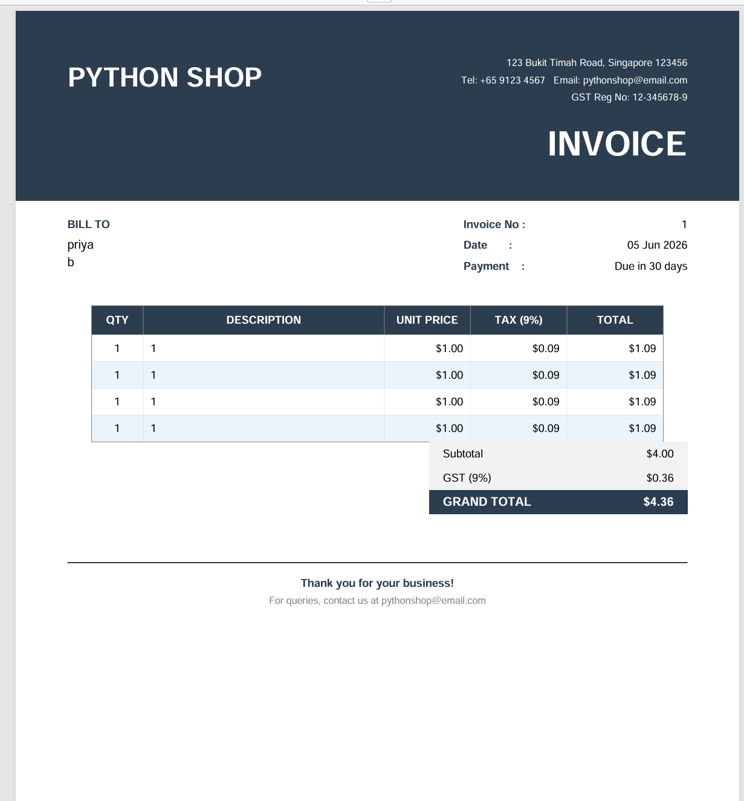

# 🧾 Invoice Generator Project 🚀

## 📌 About

This project generates professional PDF invoices using Python and ReportLab. It automates invoice creation with GST calculation and a clean business-ready format.

## ⚙️ Features

* Generate PDF invoices automatically
* GST calculation included
* Professional invoice layout
* Multiple item support
* Ready for printing and sharing

## 🛠️ Tech Stack

* Python
* ReportLab

## 📦 Installation

```bash
pip install reportlab
```

## ▶️ How to Run

```bash
python invoice_generator.py
```

## 📸 Screenshot



## 👩‍💻 Author

Priya Dharshini

GitHub: priyadhashcodes

## 💡 Purpose

This project is part of my Python freelance portfolio. It demonstrates PDF generation, invoice automation, and practical business application development using Python.
